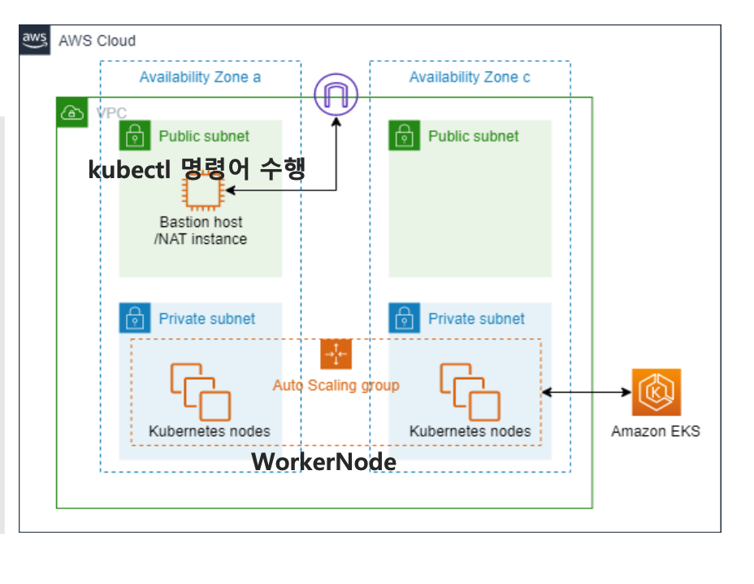

# eks-basic-class
eks-basic-class - EKS를 처음 접하는 분 ( vpc 및 subnet , bastion server을 구축합니다. )
- 2티어로 구성된 AZ zone a , c 존에  public , private 각각 2개의 subnet을 생성해주세요.
- bastion server을 public subnet에 생성해주세요.
- eks 생성은 5장에서 진행 합니다.
  *   

---

###  IP Calculator (cidr 계산기)
```
https://jodies.de/ipcalc
```
---

### [vpc 개념 및 subnet 생성 참고 사이트](https://velog.io/@lijahong/0%EB%B6%80%ED%84%B0-%EC%8B%9C%EC%9E%91%ED%95%98%EB%8A%94-AWS-%EA%B3%B5%EB%B6%80-EKS-%EA%B5%AC%EC%B6%95%ED%95%98%EA%B8%B0-%EA%B8%B0%EB%B3%B8-%ED%99%98%EA%B2%BD-%EA%B5%AC%EC%B6%95) 

